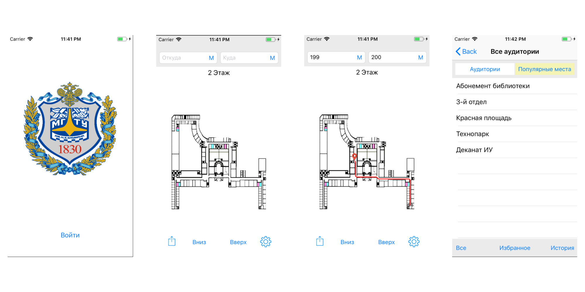

# BMSTU Navigator

Программа для навигации по Главному Зданию МГТУ им Н.Э.Баумана

## Описание

Это первый мой проект для iPhone в рамках курса по IOS разработке ТехноПарка Mail Ru
Код тут не претендует на использование паттернов и даже не работает в нескольких потоках, но все же отрабатывает задачу и строит маршрут. 
Навигация построена на волновом алгоритме по маске на карте представляющей собой матрицу размером 100x100.
Есть поиск по аудиториям которые есть на сервере, поиск маршрута даже если аудитории на разных этажах.

Для запуска приложения вам необходим файл ***GoogleService-Info.plist***
Вы можете написать мне на [oloashka@gmail.com] и я отправлю вам его для запуска на вашем устройстве

Для загрузки схемы вам необходимо подключение к интернету (файлы подгружаются при каждом запуске проекта)

### English version

*This is my first iPhone project in the course of IOS TechnoPark Mail Ru development.*

#### Description

*The code here does not claim to use patterns and does not even work in several streams, but it still works out the task and builds a route.*
*Navigation is based on a wave algorithm using a mask on a map, which is a 100x100 matrix.*
*There is a search by the audience that is on the server, a search for the route, even if the audience is on different floors.*

*To run the application you need the* *** file GoogleService-Info.plist ***
*You can email me at* [oloashka@gmail.com] *and I will send it to you to run on your device*

*To download the scheme, you need an internet connection (the files are loaded each time the project starts)*
